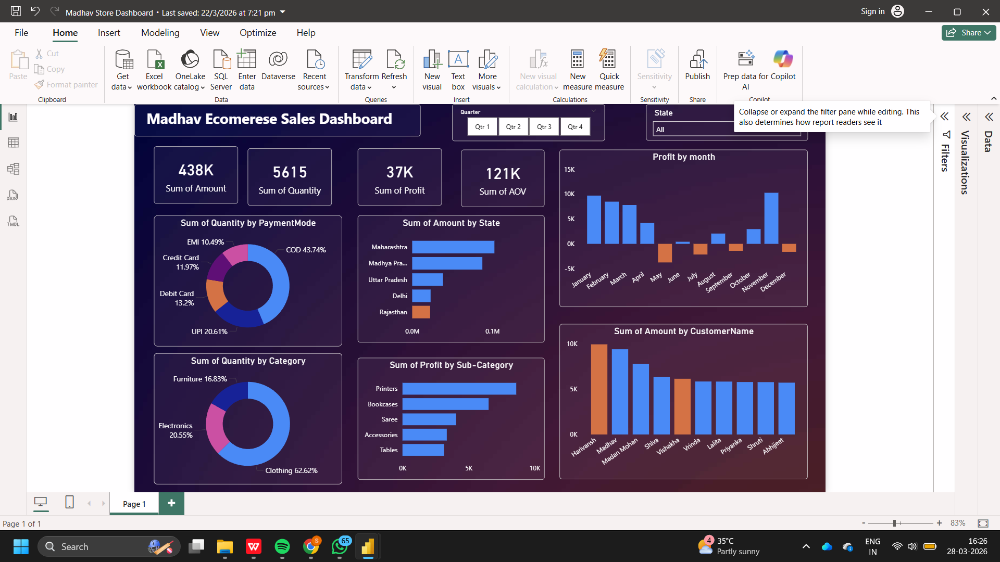

# E-commerce Sales Data Analysis Dashboard

## Overview
This project analyzes e-commerce sales data to uncover trends in revenue, products, and customer behavior.

## Tools Used
- Power BI
- SQL
- Data Cleaning & Transformation

## Key Insights
- Identified top-performing products and regions
- Analyzed revenue and profit trends
- Built interactive dashboard with filters and slicers

## Dashboard Preview

